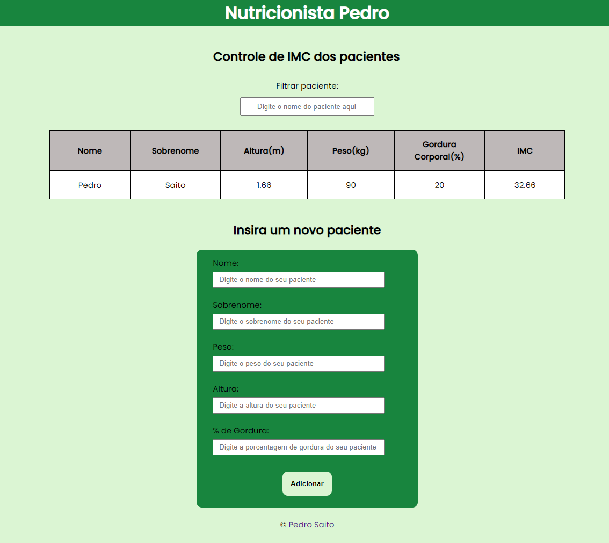

# 🍏 Calculo de IMC com JS, HTML E CSS

</img>

## Objetivo do projeto:

Colocar em prática o que foi aprendido no curso de JavaScript Web que fiz recentemente pela Alura.  
Linkedin: <a href="https://www.linkedin.com/posts/pedrosaito1_pedro-henrique-saito-pimenta-cursos-alura-activity-6864319260630511617-mp8v" target="_blank">Certificado</a>

## Funcionalidades do projeto:

✅ Adicionar paciente novos  
✅ Remover pacientes  
✅ Filtra pacientes  
✅ Validação de valores incorretos  

## Como usar?

🛠 Adicionar pacientes: preencher o formulário e clicar no botão adicionar  
🛠 Remover pacientes: clicar duas vezes na linha do paciente que quer remover  
🛠 Filtrar pacientes: digitar o nome do paciente no campo destacado  

## Tecnologia usadas: 

◾ HTML  
◾ CSS  
◾ JavaScript  

## Autor:

Pedro Saito  

</img> 

<a href="https://www.linkedin.com/in/pedrosaito1/" target="_blank">Linkedin</a>
